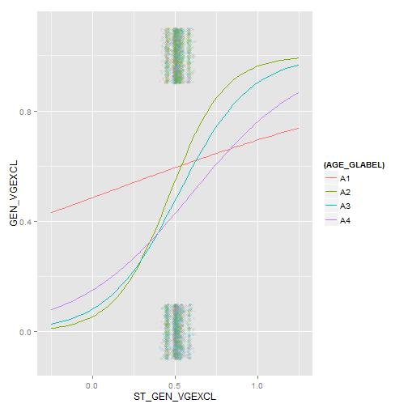

  

This document contains the methodology and R code necessary to process the small area estimates for Health Status in 2013. 

Would you say that in general your health is: 
  * Excellent, Very good: GEN_VGEXCL

## Load required libraries/connections

```r
setwd("C:/Users/robinsonm/Documents/BRFSS-small-area-estimates")
library("RODBC")
library("ggplot2")
library("arm")
```

1. BRFSS data structure
  a. predictor and response variables
2. ACS data structure
3. Exploratory Analysis and modeling
4. Predictive Results
5. Aggregating results (counties)
6. Map results


## Load the data
SQL connection reads the following data tables:
* Full record set of survey data, coded according to BRFSS 2013 manual {link here}
* State-level survey data, weighted with provided values
* Shell for prediction: a matrix of population of state/metro status/race/age/income classifications, based on 2009 - 2013 ACS and 2009 metropolitan classification (principal city/outlying county/rural)


We take a robust sample of the survey data - due to memory/processing constraints, a full analysis is not possible. 40k records represents roughly 750 records per state, and should cover a meaningful number of the 640 combinations of race/age/income/metro status across all states. 

Survey weights are used in this sample to avoid bias.


## Analyze the data
*How are our predictor variables related, at the state level?


```r
#statedata <- # make .txt

stcols <- c("AVG_GEN_VGEXCL", "MSCODE", "AVG_AGE_G", "AVG_INCOME_SCALE", "STATE")
gh_statedata <-  statedata[,names(statedata) %in% stcols]
pairs(gh_statedata)
```

 

*Tag the record-level survey with the state indicators. 
*This allows us to use the weighted state values as predictor variables. 
*We use the state FIPS code to join the data and create new fields in the record-level dataset.

```r
data$FIPS <- factor(data$FIPS)
data$ST_MSSTATUS <- statedata$MSCODE[data$FIPS]  # wt. average metro code among tracts in state
data$ST_AVG_AGE <- statedata$AVG_AGE_G[data$FIPS]  # wt. average age group among tracts in state
data$ST_AVG_INC <- statedata$AVG_INCOME_SCALE[data$FIPS]  # wt. average age group among tracts in state
data$ST_PCT_HISP <- statedata$AVG_HISPANC2[data$FIPS]  # wt. pct of survey respondents in state who are hispanic
data$ST_PCT_BLK <- statedata$AVG_BLACK[data$FIPS]  # wt. pct of survey respondents in state who are black
data$ST_PCT_WHITE <- statedata$AVG_WHITE[data$FIPS]
data$ST_PCT_OTHER <- statedata$AVG_OTHER[data$FIPS]
data$ST_PCT_MULTI <- statedata$AVG_MULTI[data$FIPS]
data$ST_GENHLTH <- statedata$AVG_GENHLTH[data$FIPS]  # wt. average general health scale
data$ST_GEN_VGEXCL <- statedata$AVG_GEN_VGEXCL[data$FIPS]
data$ST_GEN_FRPOOR <- statedata$AVG_GEN_FRPOOR[data$FIPS]


statedata$FIPS <- factor(statedata$FIPS)
```

## Prep the survey data for modeling
*Isolate predicted and predictor variables.
*Select the response variable to predict, and all possible predictors. Make sure all predictor variables are properly coded as factors.
*Relevel factors so the most prevalent category is the base.
*Use complete.cases to exclude all NA values from the sample.

```r
ghcols <- c("FIPS", "STATE", "LLCPWT", "MSLABEL", "INCOMELABEL", "AGE_GLABEL", "RACELABEL", "GEN_VGEXCL", "ST_GEN_VGEXCL")
data <-  data[,names(data) %in% ghcols]
head(data)
```

```
##   FIPS STATE MSLABEL INCOMELABEL     LLCPWT AGE_GLABEL RACELABEL
## 1   12    FL      CC          I6   755.2860         A4       RWH
## 2   39    OH      IC          I6  2109.2465         A2       RWH
## 3    6    CA      IC          I3 11698.2597         A2       RHS
## 4   55    WI      RA          I8  1016.0006         A4       ROT
## 5    6    CA      IC          I8  1871.4452         A3       RWH
## 6   36    NY      CC          I8   555.7514         A4       RWH
##   GEN_VGEXCL ST_GEN_VGEXCL
## 1          0     0.4957354
## 2          0     0.5022108
## 3          0     0.5072307
## 4          0     0.5369327
## 5          0     0.5072307
## 6          1     0.5159127
```

```r
data <- data[complete.cases(data), ]
head(data)
```

```
##   FIPS STATE MSLABEL INCOMELABEL     LLCPWT AGE_GLABEL RACELABEL
## 1   12    FL      CC          I6   755.2860         A4       RWH
## 2   39    OH      IC          I6  2109.2465         A2       RWH
## 3    6    CA      IC          I3 11698.2597         A2       RHS
## 4   55    WI      RA          I8  1016.0006         A4       ROT
## 5    6    CA      IC          I8  1871.4452         A3       RWH
## 6   36    NY      CC          I8   555.7514         A4       RWH
##   GEN_VGEXCL ST_GEN_VGEXCL
## 1          0     0.4957354
## 2          0     0.5022108
## 3          0     0.5072307
## 4          0     0.5369327
## 5          0     0.5072307
## 6          1     0.5159127
```

```r
levels(data$INCOMELABEL)
```

```
## [1] "I1" "I2" "I3" "I4" "I5" "I6" "I7" "I8"
```

```r
levels(data$RACELABEL)
```

```
## [1] "RBK" "RHS" "RMT" "ROT" "RWH"
```

```r
data$INCOMELABEL <- relevel(data$INCOMELABEL, "I8")
data$RACELABEL <- relevel(data$RACELABEL, "RWH")

levels(data$INCOMELABEL)
```

```
## [1] "I8" "I1" "I2" "I3" "I4" "I5" "I6" "I7"
```

```r
levels(data$RACELABEL)
```

```
## [1] "RWH" "RBK" "RHS" "RMT" "ROT"
```

## Exploratory modeling
*Identify relationships among variables for modeling
*Use a generalized binomial model with state fixed effects, individual fixed effects, and individual random effects. 
*Validate this model with a separate sample of the original data.


```r
# ggplot(gh_rdata, aes(x=GENHLTH, y=AGE_G | RACELABEL + INCOMELABEL, size=population)

ggplot(data, aes(x=ST_GEN_VGEXCL, y=GEN_VGEXCL, color=(INCOMELABEL), xmin=0.4, xmax=0.6)) + geom_point(position=position_jitter( width=0.01, height=0.1), alpha = 0.5, shape=21, size=2)
```

 

```r
ggplot(data, aes(x=ST_GEN_VGEXCL, y=GEN_VGEXCL, xmin=-0.25, xmax=1.25))+
  stat_smooth(method = "glm", family=binomial, fullrange=TRUE)
```

 

```r
ggplot(data, aes(x=ST_GEN_VGEXCL, y=GEN_VGEXCL, color=(AGE_GLABEL), xmin=-0.25, xmax=1.25)) + geom_point(position=position_jitter( width=0.01, height=0.1), alpha = 0.2, shape=21, size=1.5)+
  stat_smooth(method = "glm", family=binomial, fullrange=TRUE, se=FALSE)
```

 

```r
glm <- glmer(GEN_VGEXCL ~  RACELABEL + INCOMELABEL + AGE_GLABEL + ST_GEN_VGEXCL + (1| MSLABEL:RACELABEL), family = "binomial", data = data)

predictsample <- data[sample(1:nrow(data), size=5000, replace=T, prob = as.integer(data$LLCPWT)), ]

predictsample$PR_GEN_VGEXCL <- predict(
  glm, type = "response", newdata = predictsample, allow.new.levels = TRUE)
summary(predictsample$PR_GEN_VGEXCL)
```

```
##    Min. 1st Qu.  Median    Mean 3rd Qu.    Max. 
##  0.1245  0.3746  0.5320  0.5027  0.6241  0.7984
```

```r
summary(predictsample$GEN_VGEXCL)
```

```
##    Min. 1st Qu.  Median    Mean 3rd Qu.    Max. 
##  0.0000  0.0000  0.0000  0.4776  1.0000  1.0000
```

```r
summary(predictsample$ST_GEN_VGEXCL)
```

```
##    Min. 1st Qu.  Median    Mean 3rd Qu.    Max. 
##  0.4265  0.4957  0.5072  0.4999  0.5159  0.6066
```

```r
#xyplot(PR_GEN_VGEXCL1~ AGE_GLABEL | STATE, data = predictsample)
ggplot(predictsample, aes(x=INCOMELABEL, y=PR_GEN_VGEXCL)) +
    geom_point(shape=1)
```

 

## Cells for prediction
Shell for prediction contains one record for each combination of age, income, race, metro status, and state. (33,920 records)

```r
geo_shell[0:10, ]
```

```
##    FIPS MSCODE RACE AGE INCOME
## 1    34      2  RBK   3      3
## 2    24      2  RBK   3      3
## 3    42      2  RBK   3      3
## 4    10      2  RBK   3      3
## 5    34      2  RMT   2      3
## 6    24      2  RMT   2      3
## 7    42      2  RMT   2      3
## 8    10      2  RMT   2      3
## 9    34      3  RWH   4      3
## 10   24      3  RWH   4      3
```

```r
summary(geo_shell)
```

```
##       FIPS          MSCODE      RACE          AGE           INCOME    
##  Min.   :10.0   Min.   :1.00   RBK:512   Min.   :1.00   Min.   :1.00  
##  1st Qu.:20.5   1st Qu.:1.75   RHS:512   1st Qu.:1.75   1st Qu.:2.75  
##  Median :29.0   Median :2.50   RMT:512   Median :2.50   Median :4.50  
##  Mean   :27.5   Mean   :2.50   ROT:512   Mean   :2.50   Mean   :4.50  
##  3rd Qu.:36.0   3rd Qu.:3.25   RWH:512   3rd Qu.:3.25   3rd Qu.:6.25  
##  Max.   :42.0   Max.   :4.00             Max.   :4.00   Max.   :8.00
```


## Predicting the cells
*Add the state values to our shell; we need the exact same variables in the shell in order to predict.
*Use predict() to get the probability of a "Yes"
*Plot predicted results by predictor variables and states.

```r
geo_shell$ST_GEN_VGEXCL <- statedata$AVG_GEN_VGEXCL[geo_shell$FIPS]

head(geo_shell[, c(1, 6, 7, 8,9, 10)])
```

```
##   FIPS MSLABEL AGE_GLABEL RACELABEL INCOMELABEL STATE
## 1   34      CC         A3       RBK          I3    NJ
## 2   24      CC         A3       RBK          I3    MD
## 3   42      CC         A3       RBK          I3    PA
## 4   10      CC         A3       RBK          I3    DE
## 5   34      CC         A2       RMT          I3    NJ
## 6   24      CC         A2       RMT          I3    MD
```

```r
summary(geo_shell[, c(6, 7, 8, 9, 10)])
```

```
##  MSLABEL  AGE_GLABEL RACELABEL  INCOMELABEL  STATE   
##  CC:640   A1:640     RBK:512   I1     :320   DE:640  
##  IC:640   A2:640     RHS:512   I2     :320   MD:640  
##  RA:640   A3:640     RMT:512   I3     :320   NJ:640  
##  SC:640   A4:640     ROT:512   I4     :320   PA:640  
##                      RWH:512   I5     :320           
##                                I6     :320           
##                                (Other):640
```

```r
geo_shell$PR_GEN_VGEXCL <- predict(
   glm, type = "response", newdata = geo_shell, allow.new.levels = TRUE)

#plot state results against predicted values

ggplot(geo_shell, aes(x=STATE, y=PR_GEN_VGEXCL))+
    geom_boxplot(aes(group=STATE))
```

 

```r
summary(geo_shell$PR_GEN_VGEXCL)
```

```
##    Min. 1st Qu.  Median    Mean 3rd Qu.    Max. 
##  0.1080  0.2633  0.3638  0.3809  0.4828  0.7708
```

```r
head(geo_shell[, c(1, 6, 7, 8,9, 10, 11, 12)])
```

```
##   FIPS MSLABEL AGE_GLABEL RACELABEL INCOMELABEL STATE ST_GEN_VGEXCL
## 1   34      CC         A3       RBK          I3    NJ     0.5280175
## 2   24      CC         A3       RBK          I3    MD     0.5368445
## 3   42      CC         A3       RBK          I3    PA     0.4265109
## 4   10      CC         A3       RBK          I3    DE     0.4444476
## 5   34      CC         A2       RMT          I3    NJ     0.5280175
## 6   24      CC         A2       RMT          I3    MD     0.5368445
##   PR_GEN_VGEXCL
## 1     0.2970425
## 2     0.3027684
## 3     0.2359465
## 4     0.2460825
## 5     0.2822745
## 6     0.2878322
```


